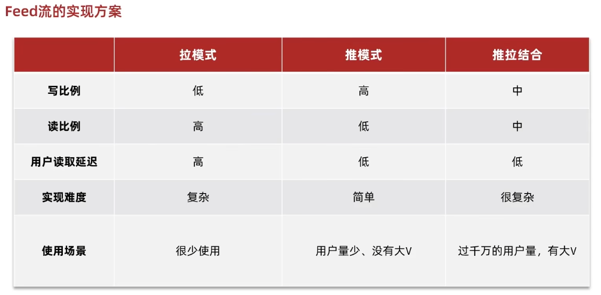

# Redis

### 登录
- 用redis储存验证码，设置过期时间
- 用redis储存token，生成随机字符或者UUID，值为用户信息json
---

### 店铺

- 用redis实现缓存，包括更新时删除缓存
- 缓存穿透--数据不存在一直访问数据库，使用空字符作为缓存（加过期时间）
- 缓存雪崩--同一时间多个缓存失效，热部署并且时间错开
- 缓存击穿--高热点数据失效重建需要时间，防止重复重建，需要用redis锁或者逻辑时间

---
### 秒杀券

- 实现一人一单以及防止超售，需要上锁(*乐观锁*和*悲观锁*)，统一用userid作为锁。
- 但是无法解决分布式集群，需要redis作为**分布式锁**，(nx + ex)
- redis锁有超时释放，如果释放了，其他线程获得锁然后原线程又释放，导致线程不安全
  - 需要检查锁是不是自己的标识符，防止误删
    - 由于检查和删除不是原子性操作，依旧可能会造成误删
  - 使用lua脚本来实现删除的原子性操作
    - 依旧有问题：不可重入，不可重试，超时释放，主从同步
  - 使用Redisson
    - 可重入: 用hash结构记录名字和次数，识别后更新
    - 可重试：用信号量(非忙等)和redis的订阅通知功能来重新尝试
    - 超时释放: 用看门狗每隔一段时间自动重置超时时间，直到被取消
    - 主从同步：每个服务器都储存锁，需要同时都获得才可以
##### 优化秒杀
- 把检查重复订单和库存的任务交个redis（**lua原子性**）做，并且建立阻塞队列，开启线程异步完成下单数据库任务
  - 用JVM的阻塞队列有两个问题，内存容量和数据安全(宕机情况)
  - 用Redis的模拟阻塞队列，解决上面两个情况，但是存在无法避免消息丢失和单消费者情况
  - 用Redis的发布订阅模式，解决但消费者问题，但是消息不持久化，无法避免丢失，以及超时缓存丢失
  - 用Redis的stream，可以保存消息，确认收到，以及回溯，有消费组提高速度防止冗杂

---
### 达人点评
- 实现上传评论，先上传图片到前端，然后回传文件名字作为参数加入数据库
- 使用redis的set实现本用户是否点赞功能，决定红心是亮还是不亮，用ismember来查
- 由于需要实现前五点赞用户的头像显示，所以使用sortedSet来优化，用时间戳作为score
  - 由于mysql的in会重新排序，所以使用order by field来重置

---
### 好友关注
- 实现关注功能，多对多三张表，并且把中间表用redis的set来实现，这样方便快速查找是否关注以及共同关注
- Feed流，关注推送
  - 
  - 实现推模式
  - 需要滚动分页而不是传统分页，由于数据实时更新，用列表的下标的分页不合适，所以使用sorted set和时间戳来实现
  - 直接推送到粉丝的sortedset里，然后每次还发送这次的最小时间和位移量方便下次查询

---
### 附近商铺
- 实现店铺分类后根据距离远近来排序
  - 使用redis geo功能，把每个商铺的经纬度坐标放入redis
  - 然后使用个人坐标来获得距离排序
  - *geo本质上是sorted set*

---
### 用户签到
- 使用BitMap来记录每日的签到情况。使用每月作为键，值最大为31位
- 使用遍历位运算来计算连续签到情况
  - 底层是String-value的

---
### UV统计
- UV，Unique View，单个自然人或者ip地址的访问次数
- PV，Page View，页面访问的次数，包括单个多次访问，所以数量比UV大
- 用Redis的Hyperloglog来实现，用小于16kb的内存实现不同数据的数量，误差低于0.81%